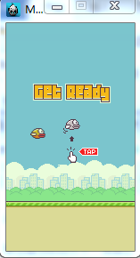
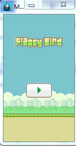
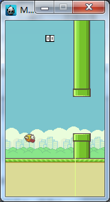

# 程序设计报告 (大二小学期)


###### -------基于Cocos2dx 3.0的游戏开发（Flappy Bird）

---------------------------------------


### 目录

- 项目概况
- 选题原因
- 项目框架
- 问题解决
- 运行截图
- 项目总结


---------------------------------------------


# 项目概况

- 项目名称：Flappy Bird
- 开发平台：cocos2dx 3.0
- 开发语言：CPP
- 开发环境：VS2012

-----------------------------------

#选题原因

- FappyBird游戏规则简单，但是可玩性极高

- cocos2dx 3.0 是2D游戏引擎的典范

- C++是我最熟悉的编程语言

C++本身是多范式的编程语言，既能够像C一样控制内存，又可以面向对象（OOP），泛型编程（GP）。C++11提供更加抽象的语法，可以auto类型自动推导，lambda匿名函数，甚至可以进行函数式编程（FP）。


-----------------------------------------
# 项目框架

 
- 开始场景类


```C++
class HelloWorld : public cocos2d::Layer
{
public:
    static cocos2d::Scene* createScene(); //创建场景
    virtual bool init();  //场景初始化
    void menuCloseCallback(cocos2d::Ref* pSender);//回调函数
    void changeScene(cocos2d::Ref *pSender); //回调函数
    CREATE_FUNC(HelloWorld); //引擎内部的宏定义
};
```

- 准备场景类


```C++
class ReayScene: public cocos2d::Layer
{
public:
    static cocos2d::Scene* createScene();
    virtual bool init();  
    void menuCloseCallback(cocos2d::Ref* pSender);
    void update(float delta);
    CREATE_FUNC(ReayScene);
    Sprite* backone; //两张背景图片中的一张
    Sprite* backtwo; //两张背景图片中的一张
};

```

- 主场景


```C++
class Mainscene : public cocos2d::Layer
{
public:
      static cocos2d::Scene* createScene();
    virtual bool init();  
    void menuCloseCallback(cocos2d::Ref* pSender);
    void changeScene(cocos2d::Ref *pSender);
    CREATE_FUNC(Mainscene);
    void update(float delta);
    void DeadAndChangeScene();
    bool Iscollision(Sprite* bird, Sprite* pipe);
private:
    // 有关背景的信息
    Sprite* background;         //屏幕背景
    Sprite* backone;            //屏幕下方两个滚动条
    Sprite* backtwo;            //屏幕下方两个滚动条
    int speed;                  //背景滚动的速度
    double px;                  //背景的坐标

    //有关鸟儿的信息
    Sprite* bird;               //小鸟
    double v0;                  //方向向上为正，向下为负
    double py;                  //鸟儿的坐标
    bool dead;                  //游戏结束的标志
    
    //水管类和分数类
    Pipes* pipes; 
    Score* sc;
};
```

- 水管类pipis


```C++
class Pipes {
    public:
        bool isDone() { return cur == maxsize; } //判断是不是已经走完了全部的水管
        Pipes( Layer* layer, int maxsize_ = 50); //默认设置的水管的数量，并将这个对象放到一个layer节点上
        ~Pipes();
        bool isCollisionWith(Sprite* rhs); // 判断是不是和鸟儿相撞
        void UpdateWithSpeed(double speed); //设计运动速度
        int getcur() { return cur; }  //返回当前是第几个水管
        int getmax() { return maxsize; } //返回最多有多少个水管
private:
        int cur; //当前水管
        int maxsize; //水管的最大数量
        std::vector<Sprite*> vp;
};
```

- 分数类score

```C++
class Score {
public:
    Score(){}
    ~Score(){}
    void InitWith(Layer* layer); //将这个对象放到一个layer节点上
    void SetNumber(int x); //设置、更新分数
    
private:
    Sprite* first;
    Sprite* second;
    int nowscore;
    void _seticon(Sprite* sp, int number);
};
```


---------------------------------
# 实际开发中与遇到的问题及解决方案


## Q1：如何理解director，scene，node等概念？
	
Cocos2dx中有一个导演（director ），控制整个游戏的开始结束，转换场景（scene）等信息，其次还有layer， menu等节点，他们除了有自己各自的特点之外都有一些共同的特征。
可以粗略的理解为他们都继承自一个Node类，节点类，这是游戏的渲染的最小的基本单位，node上可以增加node，于是他们就构成了一个渲染树，这颗树的根节点就是scene。

- 例子：
在init()，我们绑定一些node节点，并确定渲染级别，构成一颗渲染树。

```C++
// 场景一的背景画面
auto background = Sprite::create("background.png");
    background->setPosition(Point(sz.width/2, sz.height/2));
```

## Q2：如何响应鼠标单击事件？

复杂的行为可以使用回调函数，简单的使用lambda表达式即可
例子：
添加一个单击事件，如果在指定的范围内部单击，就跳转到下一个画面

```C++
auto listener = EventListenerTouchOneByOne::create();
listener->onTouchBegan = [=](Touch* t, Event* e) { //lambda按值传递局部变量
Point p = Director::getInstance()->convertToGL(t->getLocationInView());
auto target = e->getCurrentTarget();
auto box = target->getBoundingBox();
if (box.containsPoint(p)) {//如果单击的范围在精灵贴图的范围之内 
    Director::getInstance()->replaceScene(ReayScene::createScene());
            Director::getInstance()->startAnimation();
        }
        return true;
    };
    //注册监听事件
_eventDispatcher->addEventListenerWithSceneGraphPriority(listener,start); //绑定到start这个精灵（按钮）
```

这里可以避免使用回调函数，而使用lambda表达式优雅的解决

## Q3：如何更好的手动控制渲染事件？
为了实现画面的运动，首先要明白，是背景在运动，而不是鸟儿在运动，但是如何让画面运动？我们知道scene的渲染是每秒进行60次，可以打开这个功能，让我们每1/60秒执行以下update()这个函数

先打开这个功能

```C++
scheduleUpdate();
```

然后就可以在update函数中写需要执行的操作，如何实现的背景画面运动后面会讲。

## Q4：如何控制背景画面的运动？

其精髓之处就是不断地更新背景然后在每一帧里调整两张背景的\X锚点，然后就会给人一种主角再向前奔跑的感觉。
具体：设置两个图片对折，水平放置，当其中一张图片从画面中消失的时候，另一张图片进入画面。
核心代码如下：
```C++
double speed = 1;
int x1 = backone->getPositionX();
int x2 = backtwo->getPositionX();
x1 = x1 - speed;
x2 = x2 - speed;
auto mapsize = backtwo->getContentSize();
if (x1 < - mapsize.width/2) {
    x1 = mapsize.width + mapsize.width / 2 - 2; //
}
if (x2 < - mapsize.width/2) {
    x2 = mapsize.width + mapsize.width / 2 - 2;
}
backone->setPositionX(x1);
backtwo->setPositionX(x2);
```

## Q5：如何控制鸟儿的运动？

鸟儿进行的是一个自由落体运动，为了更加清晰的展示，我们使用模拟的方法，不使用API。每秒渲染60次，每次渲染更新鸟儿的位移py = py + v0 ;和速度 v0 = v0 + a * t ;

在主场景的update渲染函数中加入这样的代码

```C++
v0 = v0 - 0.15;
py = py + v0;
bird->setPosition(bird->getPositionX(), py);
```

同时，如果用户单击了屏幕，那么鸟儿会获得一个向上的初速度

## Q6：如何检测碰撞？

如果使用API解决会遇到贴图的大小和实际运动情景并不完全符合的问题，我们同样采用模拟实现。

这里我们将检测碰撞封装到pipes类中，并且传入一个bird的对象。并且每一帧都要检测碰撞。

```C++
bool Pipes::isCollisionWith(Sprite* rhs) {
    
    auto birdx = rhs->getPositionX();
    auto birdy = rhs->getPositionY();
    auto pipex = vp[cur]->getPositionX();
    auto pipey = vp[cur]->getPositionY();
    //实际上这里可以修改游戏的难度
    auto hardlevel = 25;
    if (pipex - birdx > 20) { //如果鸟儿还没有进入两个水管中间
        return false;
    } else if (birdx - pipex > 20) { //已经成功越过了这个水管
        if (cur < maxsize - 1) { cur += 1;  return false; }
        else return false;
    } else { //正在水管内部运动
        if (abs(birdy - pipey) < hardlevel) { return false; }
        else { log("DEBUG：collison with % d ", cur); return true; }
    }
}
```

## Q7：你是如何优化其他细节的？

- 鼠标单击事件之后，增加一个Bird连续的旋转动作完成，让场景更加真实，具体是先上转，再下转。

```C++
//这里可以设置一个鸟儿的旋转动作
auto uper = RotateTo::create(0.5f,-20);
auto down = RotateTo::create(0.6f,90);
auto actions = Sequence::create(uper,down,NULL);
bird->runAction(actions);
```


- Pipes记录当前的pipe，如果没有发生碰撞，传递给score一个信号，更新score+1到屏幕

```C+++
void Score::SetNumber(int x)
{
    nowscore = x;
    //取十位数字,个位数字
    int high = nowscore / 10;
    int low = nowscore % 10;
    _seticon(first, high); // 选择数字贴图更新到屏幕上
    _seticon(second, low); //选择数字贴图更新到屏幕上
}
```

-------------------------------

# 运行截图






----------------------------------
#项目总结：

这个项目是由我自己独立完成的，因此项目难度不是很大，但是，完全是从零开始做起的。由于第一次接触游戏引擎，走了不少弯路，也得出来了一些结论

- API的设计是让游戏开发变得简单，如果使用API的使用反而不利于游戏逻辑的梳理，那么这样的API不用也罢。

- 类之间一定要降低耦合度，不仅有利于模块化，而且在重构的 时候比较方便。

- DEBUG的过程很枯燥，很烦，但是这是考验一个程序员真功夫的时候。

