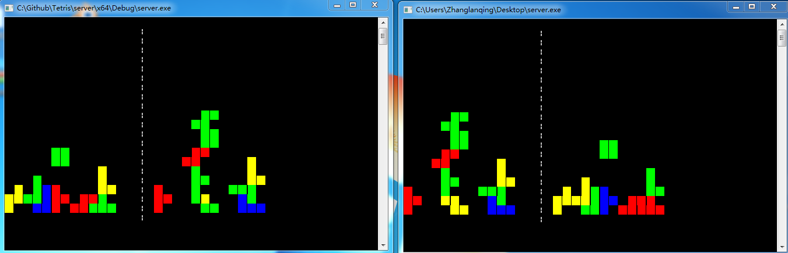

### Compile

- step 0:

please use VS2015.

- step 1:

comment out the first line in "main.cpp" to get the server of program.

- step 2:

comment the first line in "main.cpp" to get the client of the program. (Although both of them are called "server.exe")

### Quick-start:

compiled version can be found in [./bin ](./bin)

### Control

Using 'a' , 'd' to **move** left & right ; Using 'Space' to **rotate**

### Features

If TWO players are in the same local area network (LAN), they can play tha game together.

### Run

### Reference & Thanks

- [The simplest winsocket programming example.](http://www.cnblogs.com/ayanmw/archive/2012/05/03/2480854.html)

- [How to get local ip address using winsocket ?](http://blog.csdn.net/q277055799/article/details/8301581)

- Thanks for [wgtdkp's](https://github.com/wgtdkp) contributions.
